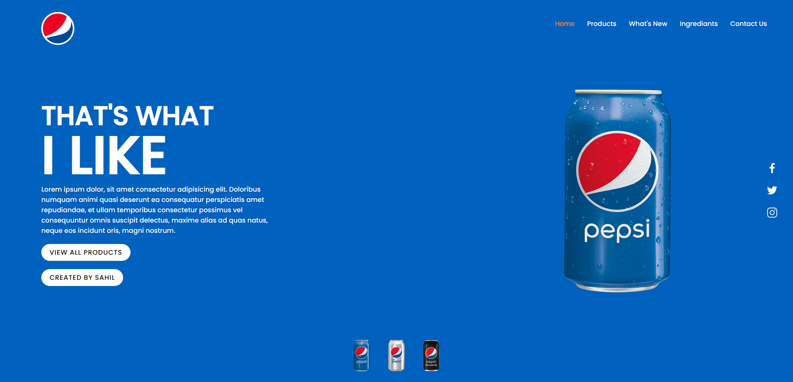

# Pepsi Landing Page

## Introduction

Welcome to the Pepsi landing page! This webpage was developed using HTML, CSS, and JavaScript to showcase the iconic Pepsi brand and its refreshing products. The design exudes energy and excitement, representing the spirit of Pepsi.

## Features

- **Dynamic Design**: The landing page features a dynamic and visually captivating design that captures the essence of the Pepsi brand.

- **Responsive**: The website is optimized to ensure seamless viewing on various devices, including desktops, tablets, and mobile phones.

- **Product Showcase**: Explore the range of refreshing Pepsi products, presented with enticing visuals.

- **Promotions**: Stay updated with the latest Pepsi promotions and offers.

- **Social Media Integration**: Connect with Pepsi on various social media platforms.

## Technologies Used

The landing page was built using the following technologies:

- **HTML**: Used for the overall structure and layout of the webpage.

- **CSS**: Employed for styling and visual enhancements, ensuring an engaging user experience.

- **JavaScript**: Implemented interactive elements and animations.
